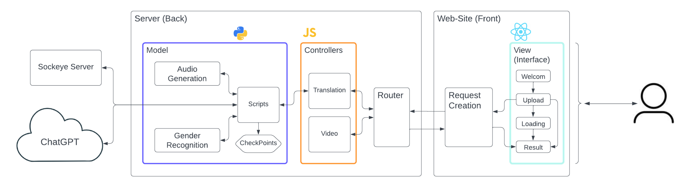

# Sign Language Transcription Project

In this project, we. Ohad Langer and Rotem Zilberman, joined the international research team, led by Amit Moriyossef at the university of Zurich. 
To see full information about the research and other models, visit: https://github.com/sign-language-processing

The goal was to create a machine-learning-based translation system from Sign Language to spoken, verbal languages, in order to bridge the communication gap for Deaf individuals.

Our model is the Sign Writing Transcription model, which translataes sequnces of sign language into their Formal Sign Writing representation, also known as FSW.


# Project Architecture

## Research Pipeline
The following image presents the full pipeline for the research.\
This whole process has the ability to take video input of sign language speakers and transcribe it into the verbal meaning depicted in it.\


## Our Model
As stated above, Our model is the Sign Writing Transcription model in the pipeline (as you can see in the image above).
This machine-learning process is represented here:


## Web Interface
Using the model we have developed and the overall pipeline, we built a MVC architecture in order to present the project and allow users to interact with it through the web.



# Instruction for Utilizing the Project

To clone this repository, run the followind command:
```bash
git clone https://github.com/ohadlanger/Sign-Language-Transcription.git
```
Open the cloned project, and execute the following instructions.\
\
********** WHERE TO SAY NPM INSTALL AND SUCH?????????????????\
\
This repository consists of all the entities required to fully utilize our project:

1) **Web Interface (Front):** implemented in React, this interface allows to use our development using a simple and clean web tool.\
to run this client, run the following commands:
```bash
cd frontend
npm start
```
2) **Server (Back):** implemented in JavaScript, this server accepts requests sent by the web client and executes the needed scripts to return appropriate responses .\
to run this server, run the following commands in a spearate terminal:
```bash
cd backend
node app.js
```

3) **Model:** implemented in Python, this Model is used by the server to preform the translation process using the machine-learned checkpoint (weights file for the model).\
It is being executed by the server, therefore no need to run it yourselves.

\
Overall, after activating the different sides of the architecture, using your browser you can browse to the following address: http://localhost:3000.

